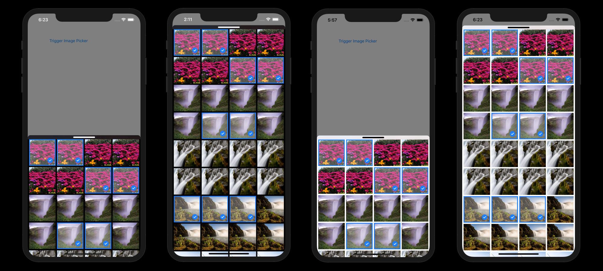

# ConvenientImagePicker
**ConvenientImagePicker** is a beautiful and simple image picker solution for iOS development written on Swift. It's a view controller that can simply present it everywhere. Excellent interaction, Mutiple selection, Photo picker, Dark mode, and so on.

[](https://starkidstory.com)
[](https://cocoapods.org/pods/ConvenientImagePicker)
[](https://cocoapods.org/pods/ConvenientImagePicker)
[](https://cocoapods.org/pods/ConvenientImagePicker)


[](https://github.com/CLOXnu/ConvenientImagePicker/blob/master/README.zh-cn.md)

## Release Notes

the newest version is 0.2.2, Add `assetsSortKey` and `assetsSortAscending` property, the order of pictures is now customizable! thanks for @Édouard. More information see [Release Notes](ReleaseNotes.md).

## Overview

**ConvenientImagePicker** provides smooth interaction, has excellent user experience, it can display system photo album and can also display the specified images.

It is worth emphasizing that the **ConvenientImagePicker** view has precise gesture control.


## Requirements

- iOS 9.3+
- Xcode 9.0+
- Swift 4.0+

## Installation

**ConvenientImagePicker** can be installed through [CocoaPods](http://cocoapods.org), add the following entry to your Podfile:

```ruby
pod 'ConvenientImagePicker'
```

Then run ```pod install```,

and include the image picker wherever you need it with

```swift
import ConvenientImagePicker
```

, it's really a simple way.

## Usage

When you prepare to present this image picker, we assume that you will call a function like this:

```swift
func PresentPhotoPicker()
```

Well, the most simplest version is add the following code in this function:

```swift
let pickerViewController = PickerViewController()
pickerViewController.delegate = self
pickerViewController.isSupportLandscape = true // A Boolean value that determines whether the ability of landscape exists.
self.present(pickerViewController, animated: true, completion: nil)
```

Then, you are supposed to implement ```ConvenientImagePickerDelegate``` in your own view controller:

And implement these delegate function:

```swift
func imagePickerDidCancel(_ selectedImages: [Int : UIImage])
func imageDidSelect(_ imagePicker: PickerViewController, index: Int, image: UIImage?)
func imageDidDeselect(_ imagePicker: PickerViewController, index: Int, image: UIImage?)
func imageSelectMax(_ imagePicker: PickerViewController, wantToSelectIndex: Int, wantToSelectImage: UIImage?)
```

```imagePickerDidCancel``` will inform you that user has cancelled the image picker, and return the images user has selected.

```imageDidSelect``` will inform you that user has selected an image.

```imageDidDeselect``` will inform you that user has deselected an image.

```imageSelectMax``` will inform you that user want to select an image, but this time he has selected the limit number of images.

---

You can use ```imagePicker.selectedImageCount``` in last 3 functions to get the number of the images user has selected.

Do not initialize ```pickerViewController``` outside of function ```PresentPhotoPicker```.

So far, this is the simplest usage of this pod.

## Optional Configuration

Sure, You can use more features of the image picker, or even customize it, instead of just using the default configuration.

Start with ```let pickerViewController = PickerViewController()``` :

```swift
pickerViewController.maxNumberOfSelectedImage = 50 // The maximum number of pictures allowed.
pickerViewController.allowMultipleSelection = true // A Boolean value that determines whether the picker view can mutiple selection.
pickerViewController.numberOfPictureInRow = 4 // The number of pictures in a row.
pickerViewController.intervalOfPictures = 5.0 // The interval between pictures.
pickerViewController.isSimpleMode = true // A Boolean value that determines whether the title label, count view, and close button exist.
pickerViewController.images = nil // The displayed images, it's will be photo library if nil.
pickerViewController.isDarkMode = false // A Boolean value that determines whether darkmode enable.
pickerViewController.isSwitchDarkAutomately = true // A Boolean value that determines whether darkmode can switched automately. (only iOS 13 valid)
pickerViewController.initialSelectedIndex = [0,1,2,3,4] // A set of index of selected image when the picker appears.
pickerViewController.isAnimated = true // A Boolean value that determines whether the appear animation exists.
pickerViewController.customSelectedImage // A selectedImage type value that relates to the image of selected picture.
pickerViewController.isSupportLandscape = true // A Boolean value that determines whether the ability of landscape exists.
pickerViewController.assetsSortKey = "modificationDate" // A String value that determines whether the order key of all assets.
pickerViewController.assetsSortAscending = false // A Boolean value that determines whether the order way of all assets.
```

### when 'isSimpleMode = false'


When ```pickerViewController.isSimpleMode = false``` appear in your configure list, you are supposed to learn about ```titleView```, ```titleLabel```, ```countLabel```, ```doneButton```, and ```titleViewEffectView```.(As shown on the right)

You can customize ```titleView```, ```titleLabel```, ```countLabel```, and ```doneButton``` when ```isSimpleMode = false```.

You can also customize ```titleViewEffectView```, ```mainView```, and ```collectionView``` regardless of the value of ```isSimpleMode```, because they are always exist.

By the way, ```decorationBar``` can be customized in the case of ```isSimpleMode = true```.

If more in-controller-override needed, ```extension PickerViewController``` is necessary.

## ⚠️Notice

* Do not forget to add ```NSPhotoLibraryUsageDescription``` in your Info.plist if you want to present a photo picker.
* Check read album permissions before using photo picker.
* Please initialize new variable ```pickerViewController``` whenever preparing to present the image picker.

## Instance

In [TextCard](https://apps.apple.com/cn/app/%E6%96%87%E5%AD%97%E5%8D%A1%E7%89%87/id1473078157), which is an iOS App has imported **ConvenientImagePicker**.


## License

**ConvenientImagePicker** is released under the MIT license. See [LICENSE](LICENSE.md) for details.

Thank you for your support!🙏


